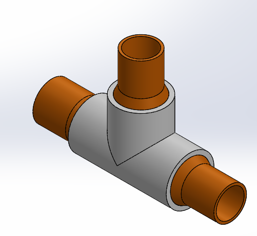
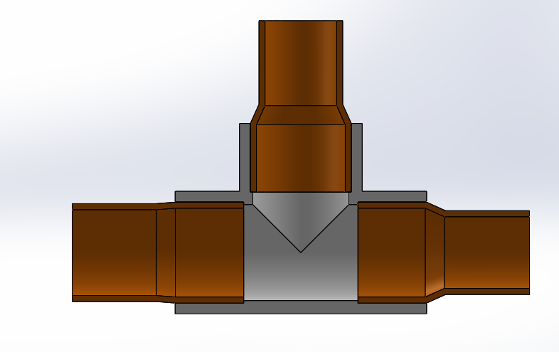
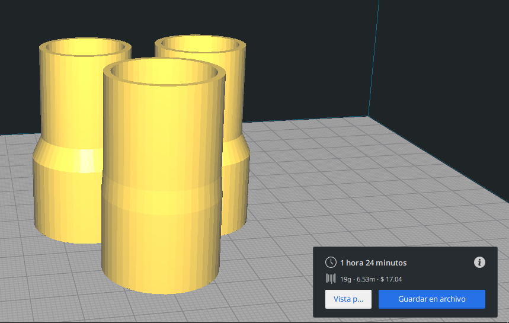

now you have a file called stl.rar
download this and put it on your slicer you shoud print 1 of cople and two pieces of cople 2 to assemble 1 complete splitter you can now go to your local hardwere store and buy yourself a bunch of 3/4" hidraulic PVC pipe fitting
